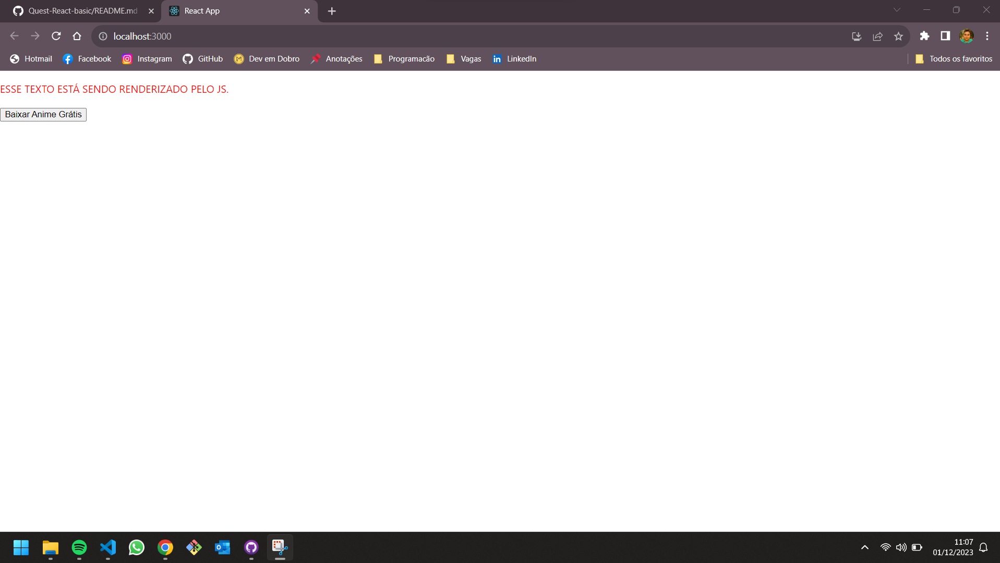

# Quest React básico

## Autor

- Linkedin - [Emanuel C. Flôres](https://www.linkedin.com/in/emanuel-c-flores/)

Este é um desafio proposto no curso do [Dev em Dobro(DevQuest)](https://www.instagram.com/devemdobro)

### O desafio
Este desafio foi proposto duas atividades, onde uma delas tinha que criar um texto e renderizar seu estilo e cor através do Javascript.
Na segunda atividade tinha que Criar um componente Button com um evento de clique que apresente um alerta informando a prop label do botão que foi clicado.

### Captura de tela

##### Desktop 
